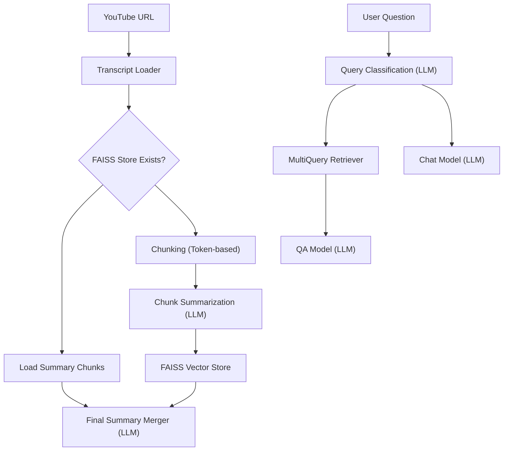

# 🎬 YouTube Video Summarizer + QA Chatbot

This project leverages **LangChain**, **Groq LLMs**, and **FAISS** to turn any YouTube video into a summarized report, and lets you chat with an AI about its content — all in a slick Streamlit UI!

---

## 🚀 Features

✅ Extracts transcript from a YouTube video  
✅ Summarizes in **chunked + merged** fashion using token-aware throttling  
✅ Stores embeddings in **FAISS** vector store  
✅ Query classification: detects if user input is video-related  
✅ Fully integrated **Q&A chatbot** using retriever-augmented generation  
✅ **Streamlit frontend** with expandable summary and persistent chat history

---

## 💡 LLMs Used

| Task | Model |
|------|-------|
| Chunk Summarization | `meta-llama/llama-4-scout-17b-16e-instruct` |
| Final Summary | `llama-3.3-70b-versatile` |
| Q&A | `meta-llama/llama-4-scout-17b-16e-instruct` |
| Multiquery Retriever | `llama-3.3-70b-versatile` |
| Query Classification | `meta-llama/llama-4-maverick-17b-128e-instruct` (Structured Pydantic Output) |

---

## 📦 Tech Stack

- [LangChain](https://www.langchain.com/)
- [Groq LLMs](https://groq.com/)
- [Streamlit](https://streamlit.io/)
- [FAISS](https://github.com/facebookresearch/faiss)
- [YouTubeTranscriptAPI](https://pypi.org/project/youtube-transcript-api/)

---

## 🧠 Architecture




### 📋 Installation

1. **Clone the repository**  
   ```bash
   git clone https://github.com/shubh586/GenAiGit.git
   cd GenAiGit/YoutubeQASummary
   ```

2. **Create and activate a virtual environment**  
   **Windows (PowerShell):**  
   ```bash
   .\venv\Scripts\Activate
   ```  
   **Linux/macOS:**  
   ```bash
   python -m venv venv
   source venv/bin/activate
   ```

3. **Install the dependencies**  
   ```bash
   pip install -r requirements.txt
   ```

4. **Set up environment variables**  
   Create a `.env` file in the root directory with:
   ```env
   GROQ_API_KEY=your_groq_api_key_here
   HUGGINGFACE_API_KEY=your_huggingface_api_key_here
   ```

### 🏁 Run the App

Launch the Streamlit interface:

```bash
streamlit run pipeline/streamlit.py
```


